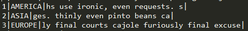
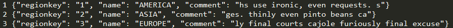

## Description
一个数据库实验的作业。先用tpc-h生成8个表的数据，再把这些数据转成json的格式，然后导入数据库中，完成一些查询操作。

## Datatype
TPC-H生成的数据格式 

我们的需要的数据格式 

## How to use
+ 先用TPC-H生成数据，[具体如何生成](http://blog.csdn.net/leixingbang1989/article/details/8766047%20%22%E5%85%B7%E4%BD%93%E5%A6%82%E4%BD%95%E7%94%9F%E6%88%90%E2%80%9C)
+ 然后将生成的.tbl数据文件放到data文件夹下
+ 然后命令行输入 node index.js
+ 等待完成
+ over
